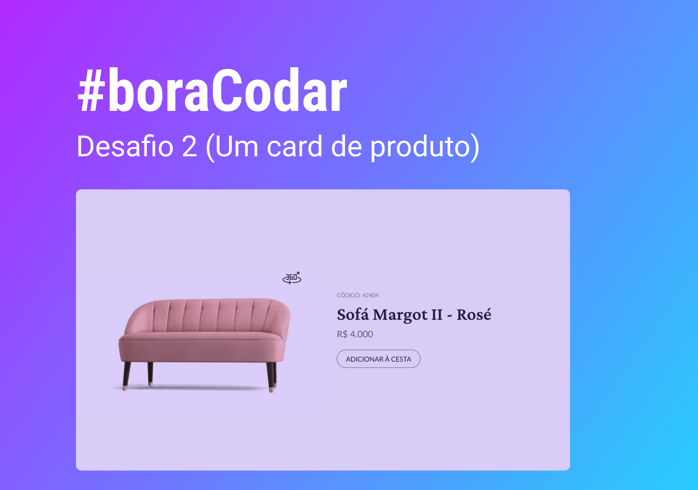

# Productcard

  Projeto criado para o desafio #boracodar da Rocketseat

  

## Tecnologias

Esse pojeto foi desenvolvido com as seguintes tecnologias:

- CSS
- Js
- TypeScript
- Git e Github

##projeto

O Product card é um cartao de venda de um produto que eu desenvolvi para a pratica dos meus estudos em programação.

## Layout

Voce pode visualizar o layout do projeto através [DESSE LINK](https://www.figma.com/file/hcAa3kuaWh9S1QHvfqyTgc/%23boraCodar---Desafio-2-(Copy)?node-id=0%3A1&t=DPCvuvKQTEGnzcun-0). É necessário ter uma conta no [Figma](https://figma.com) para acessá-lo.

## Contato

lipexingu18@gmail.com
